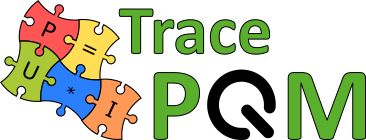

# TWM - TracePQM Wattmeter (builds)

TWM is developed in scope of [EMPIR](https://msu.euramet.org/calls.html) project [TracePQM](http://tracepqm.cmi.cz/).

TWM is a transparent, metrology grade measurement system for traceable measurement of the Power and Power Quality (PQ) parameters. However, it is not restricted to power and PQ area only. It is designed to allow recording of the voltage and current waveforms using various digitizers and processing the measured waveforms using ANY algorithm. It is composed of two main components:
- User interface and instrument control in [LabVIEW](http://www.ni.com/labview/),
- [GNU Octave](https://www.gnu.org/software/octave/) or [Matlab](https://uk.mathworks.com/products/matlab.html) calculation scripts for data processing.

This git contains only builds of the TWM tool, which can be found at another git: [smaslan/TWM](https://github.com/smaslan/TWM)

## Major changes
- V1.8.7.0, 2024.10.14:
  - many fixes
  - TWM server command for multiplexer virtual channels definition
  - Fluke8588A now works using USB interface (faster data transfer).
  - TWM-RATWFFT - simple alg for complex voltage ratio (not validated!)
  - 3458A sample clock generation by RaS HMF2500 generators
  - QPMX multiplexer
  - FFT calculation in TWM if QWTB spectrum not available
  - waveform viewer allows also viewing per transducers with basic scaling
  - implemented 3458A Ts step rounding of Ts/fs
  - Keysight DSO and NI 5922 now has pretrigger option (tested on DSOS604, not tested on 5922)
  - short correction for TWM-InpZ algorithm

- V1.7.5.0, 2022.01.12:
  - Conversion to LabVIEW 2020.
  - Implemented experimental time-multiplexing for digitizers with support of timestamping and emulated timestamping for 3458A.
  - Added partial support for Fluke 8588A (depends in FW version of F8588A).
  - Added few more specific sample clock generators for 3458A.
  - Added basic support for cDAQ NI9238 module.
  - Added basic support for Keysight DSOs (tested with DSOS0604).
  - Added capability for parallel processing of TWM records (very experimental, not properly tested).
  - Minor bug fixes in algorithms (improved performance at some fringe conditions).
  - Added new algorithm TWM-LowZ for low impedance measurements and voltage ratio measurements.
  - Many small fixes and improvements in TWM GUI.
  - :warning: This version was not properly validated! Although it is being intensively used, there might be some critical bugs. :warning:

- V1.6.1.0, 2019.04.15:
  - Minor fixes in correction editors.
  - GUI should work properly when Windows uses decimal comma separator.
  - Algorithm TWM-WFFT minor fix for differential input (was returning complex values in some cases).
  - DirectSound driver fixed.
  
- V1.6.0.0, 2019.04.04:
  - Fixed 5922 timestamp errors for streaming mode and new selector for different reference clock sources.
  - GNU Octave configuration now includes simple package assistant to avoid using the ".octaverc" startup file.
  - GUI extended, so all correction files and matrices can be edited via TWM itself.
  - Added new algorithm TWM-PWRFFT for power calculation using FFT for coherent sampling.
  - Digitizer corrections should be usable even for a digitizer with less channels than defined in the correction file as long as identifiers match.

## Build versions
TWM builds are often available in multiple versions. To prevent installation of unnecessary instrument drivers,
select the version supporting only the digitizers you need.

### version `full`
The executable filename is `TWM.exe`.
Supports all digitizers. That is:

- HP/Keysight/Agilent 3458A
- Fluke 8588A,
- NI5922,
- DAQmx,
- Soundcard (Windows system driver).

This version requires installation of following drivers:

- NI VISA
- NI Scope
- NI DAQmx

### version `visa-daqmx`
The executable filename is `TWM-visa-daqmx.exe`.
Does not support NI 5922. NI Scope driver is not required.

### version `visa-niscope`
The executable filename is `TWM-visa-niScope.exe`.
Does not support NI DAQmx digitizers. NI DAQmx driver is not required.

### version `visa`
The executable filename is `TWM-visa.exe`.
Does not support NI 5922 and NI DAQmx. Drivers NI Scope and NI DAQmx are not required.

### version `client`
This is build of LabVIEW library used to controll TWM externally.

## Downloads

Select version built only with required digitizers support to prevent installing of unnecessary instrument drivers:

- [V1.10.0.0 full, 2024.12.17 (ZIP file)](./builds/TWM-1.10.0.0-full.zip)
- [V1.10.0.0 client, 2024.12.17 (ZIP file)](./builds/TWM-1.10.0.0-client.zip)
- [V1.8.7.0 full, 2024.10.14 (ZIP file)](./builds/TWM-1.8.7.0-full.zip)
- [V1.8.7.0 client, 2024.10.14 (ZIP file)](./builds/TWM-1.8.7.0-client.zip)
- [V1.7.5.0 (built with: all*), 2022.01.12 (ZIP file)](./builds/TWM-1.7.5.0-full.zip)
- [V1.6.1.0 (built with: 3458A, NI5922, Soundcard), 2019.04.15 (ZIP file)](./builds/TWM-1.6.1.0-full.zip)
- [V1.6.1.0 (built with: 3458A, Soundcard), 2019.04.15 (ZIP file)](./builds/TWM-1.6.1.0-visa.zip)
- [V1.6.0.0 (built with: 3458A, NI5922, Soundcard), 2019.04.04 (ZIP file)](./builds/TWM-1.6.0.0-full.zip)
- [V1.6.0.0 (built with: 3458A, Soundcard), 2019.04.04 (ZIP file)](./builds/TWM-1.6.0.0-visa.zip)
- [V1.5.0.0 (built with: 3458A, NI5922, Soundcard), 2019.01.24 (ZIP file)](./builds/TWM-1.5.0.0-full.zip)
- [V1.5.0.0 (built with: 3458A, Soundcard), 2019.01.24 (ZIP file)](./builds/TWM-1.5.0.0-visa.zip)
- [V1.3.0.0 (built with: 3458A, NI5922, Soundcard), 2018.08.23 (ZIP file)](./builds/TWM-1.3.0.0-full.zip)

\* Note: Since version V1.7.5.0, the build always contains several executables built for various drivers. Simply run the one required.

## License
The TWM is distributed under [MIT license](./LICENSE.txt). Note the algorithms in the QWTB toolbox may have different licenses.
